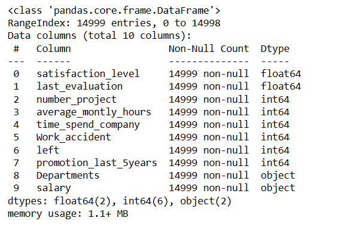
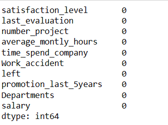
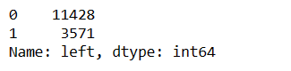
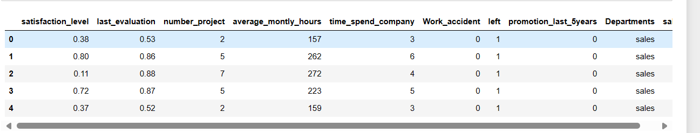
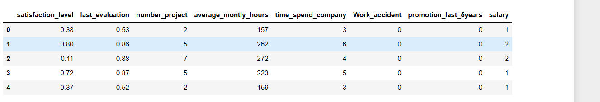
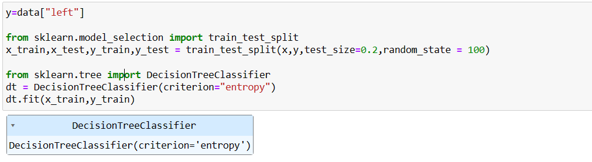
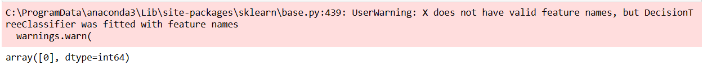

# Implementation-of-Logistic-Regression-Using-Gradient-Descent

## AIM:
To write a program to implement the the Logistic Regression Using Gradient Descent.

## Equipments Required:
1. Hardware – PCs
2. Anaconda – Python 3.7 Installation / Jupyter notebook

## Algorithm
```
1.Import pandas module and import the required data set.
2.Find the null values and count them.
3.Count number of left values.
4.From sklearn import LabelEncoder to convert string values to numerical values.
5.From sklearn.model_selection import train_test_split.
6.Assign the train dataset and test dataset.
7.From sklearn.tree import DecisionTreeClassifier.
8.Use criteria as entropy.
9.From sklearn import metrics.
10.Find the accuracy of our model and predict the require values.
```

## Program:
```
/*
Program to implement the the Logistic Regression Using Gradient Descent.
Developed by: Guttha Keerthana
RegisterNumber: 212223240045

1.
import pandas as pd
data = pd.read_csv("Employee.csv")
data.head()
data.info()

2.
data.isnull().sum()

3.
data["left"].value_counts

4.
from sklearn.preprocessing import LabelEncoder
le= LabelEncoder()
data["salary"]=le.fit_transform(data["salary"])
data.head()

5.
x=data[["satisfaction_level","last_evaluation","number_project","average_montly_hours","time_spend_company","Work_accident","promotion_last_5years","salary"]]

x.head()

6.
y=data["left"]

from sklearn.model_selection import train_test_split
x_train,x_test,y_train,y_test = train_test_split(x,y,test_size=0.2,random_state = 100)

from sklearn.tree import DecisionTreeClassifier
dt = DecisionTreeClassifier(criterion="entropy")
dt.fit(x_train,y_train)

7.
y_pred = dt.predict(x_test)
from sklearn import metrics

accuracy = metrics.accuracy_score(y_test,y_pred)
accuracy

8.
dt.predict([[0.5,0.8,9,260,6,0,1,2]])
*/
```

## Output:

1



2



3



4



5



6



7


8




## Result:
Thus the program to implement the the Logistic Regression Using Gradient Descent is written and verified using python programming.

